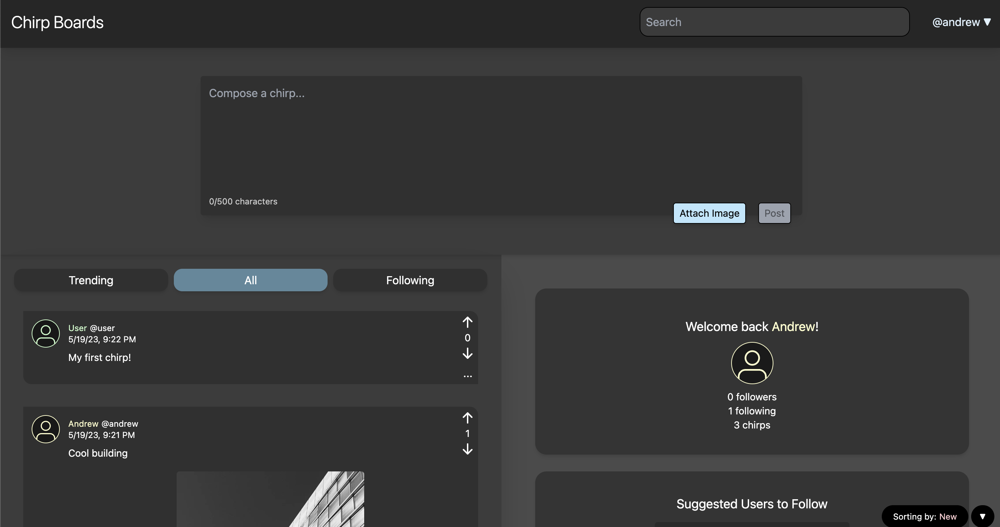

# Chirp Boards

## Description
[Chirp Boards](https://chirpboards.web.app) is a full stack social media app that is similar to Twitter and Reddit. Like Twitter, users can "chirp" out short status messages up to 500 characters long. Users can also "rechirp" other users' chirps. Each chirp opens to a forum board like Reddit where users can comment and upvote/downvote posts.




## Technologies
- [Java Spring Boot](https://spring.io/projects/spring-boot)
- [GraphQL](https://graphql.org/)
- [MySQL](https://dev.mysql.com/doc/)
- [Azure Blob Storage](https://docs.microsoft.com/en-us/azure/storage/blobs/storage-blobs-introduction)
- [TypeScript](https://www.typescriptlang.org/download)
- [React](https://reactjs.org/docs/getting-started.html)
- [Tailwind CSS](https://tailwindcss.com/docs/guides/create-react-app)
- [Docker](https://docs.docker.com/get-docker/)

## Installation
Clone this repository.

```
git clone https://github.com/andrewctam/ChirdBoards.git
```

In `/frontend`, rename `.env.template` to `.env`, and update the environmental variables.

In `/backend/src/main/resources`, rename `application.properties.template` to `application.properties`, and update the fields.
- Add your MySQL Database URL and credentials
- Add your Azure Blob Storage connection string (optional, but image uploading requires it)

### Docker
To run with docker, run `docker compose up` at the root. 
```
docker compose up
```


### No Docker
To run the back end, run `./mvnw spring-boot:run` in `/backend`.

```
./mvnw spring-boot:run
```


For the front end, install npm dependencies and run ```npm start``` in `/frontend`.
```
npm install
npm start
```
